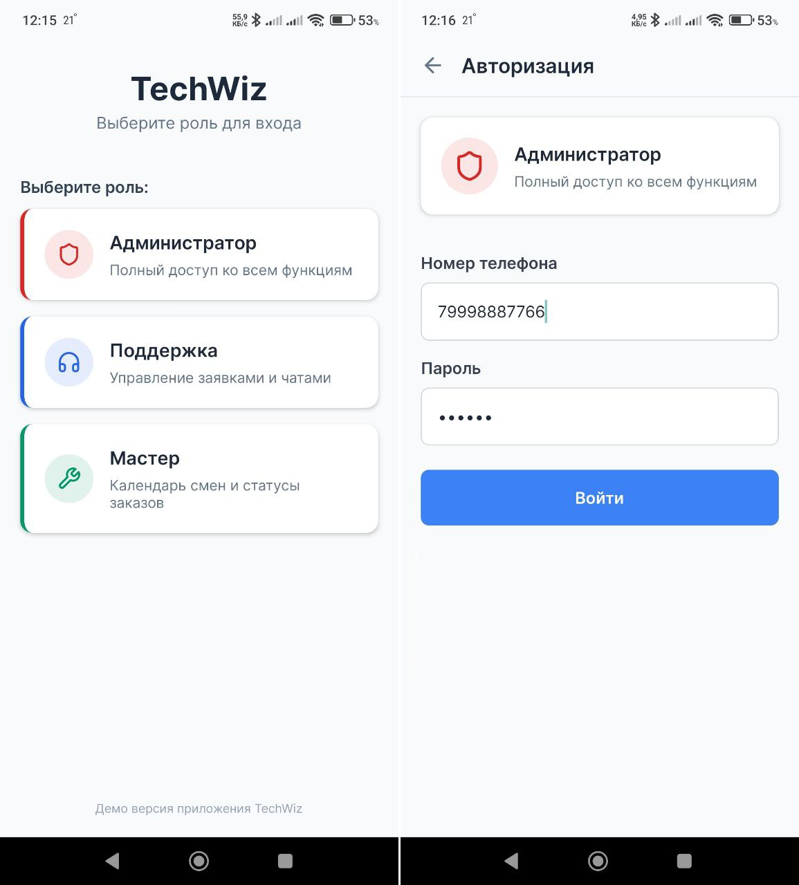
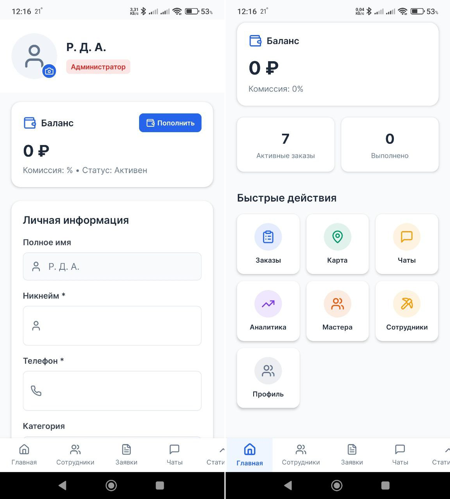
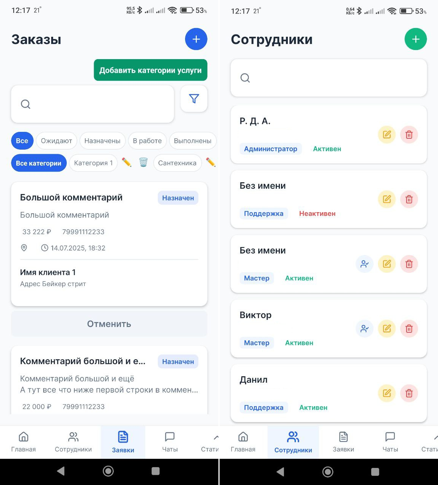
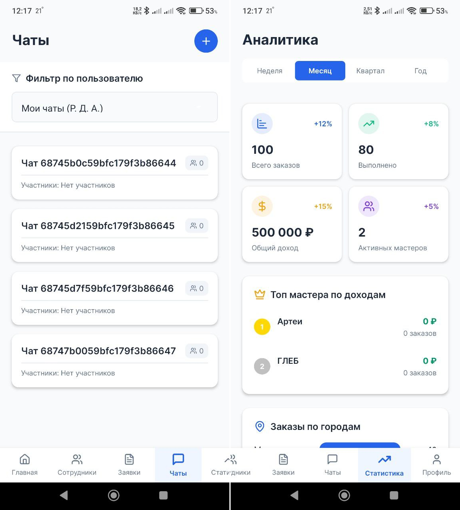
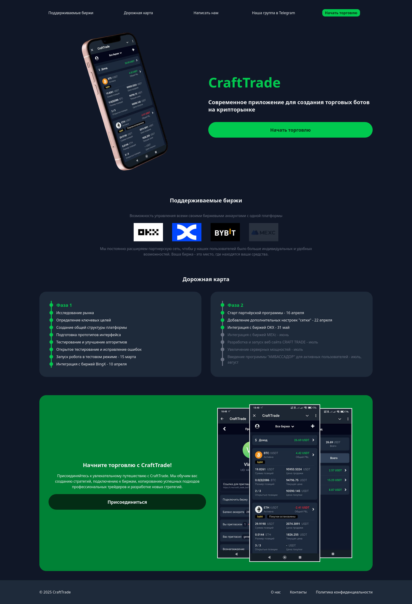
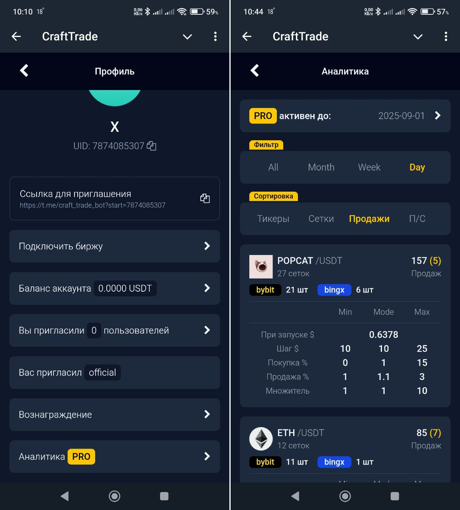
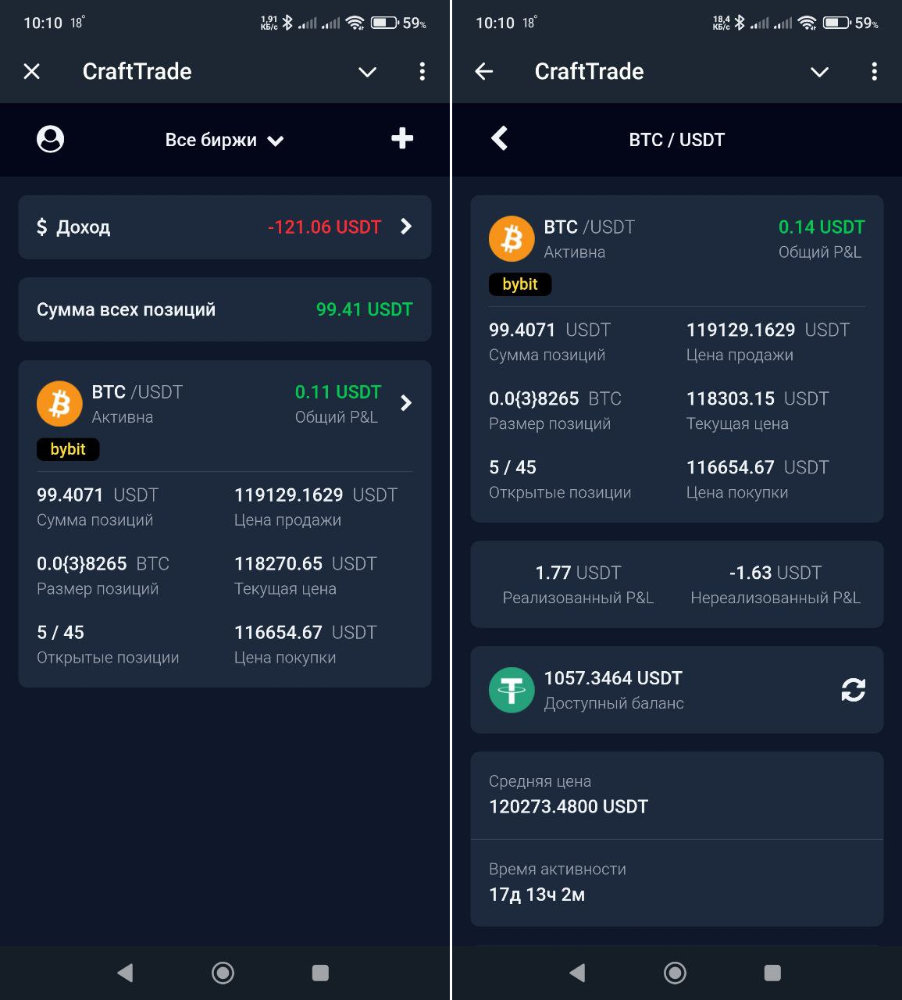

# Портфолио

Здесь вы найдете скриншоты и краткие описания моих выполненных проектов.

## Android приложение на React Native

Используемые технологии:

- Docker/Compose
- MongoDB
- React Native
- Expo

## Статический сайт лендинг

Используемые технологии:

- Docker/Compose
- Traefik
- Svelte

## Telegram MiniApp бот

Используемые технологии:

- Docker/Compose
- MongoDB
- Redis
- Python/FastAPI
- Traefik
- Svelte

Основные библиотеки:

- aiogram
- asyncio
- numpy
- pydantic
- requests
- threading
- web3
- websockets

